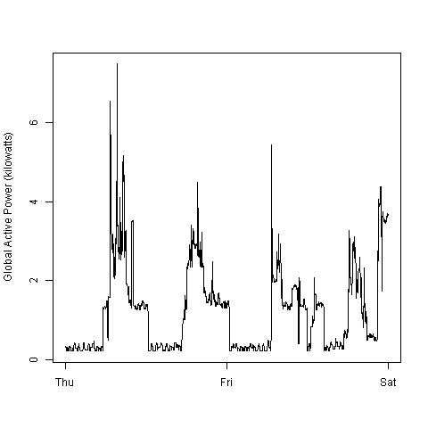

Exploratory Data Analysis Project 1
===================================
##Summary Description

Source dataset is "Individual household electric power consumption Data Set" from the 
<a href="http://archive.ics.uci.edu/ml/">UC Irvine Machine
Learning Repository</a>, a popular repository for machine learning
datasets.  The project assignment require us to load the data and reconstruct 4 plots from
the household energy usage over a 2 day period in February, 2007 using base plot system
in R.

* Input files: exdata_data_household_power_consumption.zip, household_power_consumption.txt
* R script files: plot1.R, plot2,R, plot3.R plot4.R
* Output file: plot1.png, plot2.png, plot3.png, plot4.png

##Steps to execute R scripts

###Assumption
-------------
1. data.table, lubridate, and dplyr package are already installed, if not please type 
install.packages(c("data.table", "lubridate", "dplyr") on either R or R Studio console 
and hit Enter to download online and install it.

2. You must have internet access to either allow the script to download the original 
dataset or obtain the files manually yourself.

3. Your current working directory is already setup and the environment is clean 
(meaning there are no other work, data, variables in the environment, environment will 
be automatically wiped clean when running the script).

4. R script files are already saved in current working directory, if not, please right 
click on the following link and save them to corrent working directory.
* [plot1.R](https://raw.githubusercontent.com/courseramchen2k2/ExData_Plotting1/master/plot1.R) 
* [plot2.R](https://raw.githubusercontent.com/courseramchen2k2/ExData_Plotting1/master/plot2.R) 
* [plot3.R](https://raw.githubusercontent.com/courseramchen2k2/ExData_Plotting1/master/plot3.R) 
* [plot4.R](https://raw.githubusercontent.com/courseramchen2k2/ExData_Plotting1/master/plot4.R) 

###Automatic method
-------------------
1. Just source plot1.R by typing source("./plot1.R") and hit Enter to execute plot1.R

2. Just source plot2.R by typing source("./plot2.R") and hit Enter to execute plot2.R

3. Just source plot3.R by typing source("./plot3.R") and hit Enter to execute plot3.R

4. Just source plot4.R by typing source("./plot4.R") and hit Enter to execute plot4.R

###Manually obtain the dataset yourself
---------------------------------------
1. Click on this [LINK](https://d396qusza40orc.cloudfront.net/exdata%2Fdata%2Fhousehold_power_consumption.zip) 
to download the dataset and save it to your current working directory.

2. Just source plot1.R by typing source("./plot1.R") and hit Enter to execute plot1.R

3. Just source plot2.R by typing source("./plot2.R") and hit Enter to execute plot2.R

4. Just source plot3.R by typing source("./plot3.R") and hit Enter to execute plot3.R

5. Just source plot4.R by typing source("./plot4.R") and hit Enter to execute plot4.R

## Result Plot 
### Plot 1

 

### Plot 2

 

### Plot 3

 

### Plot 4

 

